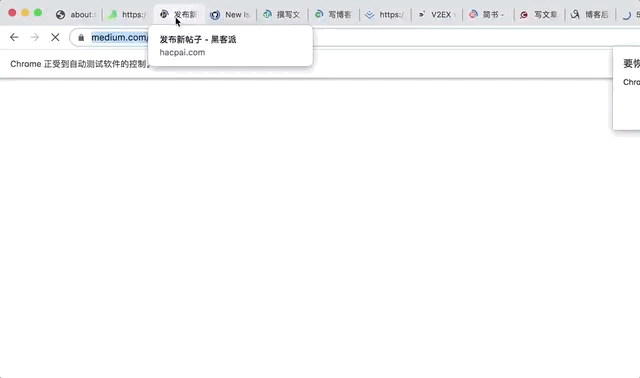

# Introdution
把你的语雀文章分享到各大博客网站上。



## Features
支持分享的语雀文章类型：
- 公开文章
- 私密文章

支持同步文章到以下网站：
- 黑客派
- GitHub
- 思否
- 开源中国
- 掘金
- v2ex
- 简书
- csdn
- 博客园
- 51CTO
- 知乎
- Medium

## Set Up
安装puppeteer完整版

```sh
yarn
```

创建目录储存浏览信息

```sh
mkdir user-dir
```

则第一次打开网页时，提示要登录，手工进行后，之后再启动程序打开网站，就能保持登录状态，不需要重新登录了。

## Usage

需要传环境变量POST，它的值为要分享的语雀文章的URL绝对地址

```sh
POST=https://www.yuque.com/your-link node index.js
```

## Notice

### 样式问题
复杂点的文章，很多网站会格式错乱,以[🔨揭秘vue-sfc-cli: 组件研发利器](https://zhuanlan.zhihu.com/p/72590127)为例:

- 嵌套代码块
- 代码里添加多行注释
- 代码里含有换行的{}, 这样所有新内容都会在尖括号里面
- yaml/sh等内容有缩进, 这样会造成缩进混乱

解决方案：把以上内容变成图片。对最后一点，如果只有一层缩进，也可以把缩进消除，达到格式不错乱的目的

另外，知乎与Medium可能会出现这种情况：只要出现代码块，后面的内容就全在代码里了

知乎可以通过可以导入文档来解决此问题; Medium可以通过复制/粘贴来解决此问题

### 网站特点

知乎是不能显示在线图片的，也即 `` 语法无效。

简书需要新建一个空白文档，作为占位，则在 `site-list.js` 中简书的url为该文章的绝对路径


### 其他
- 如果需要下载pdf或截屏，则指定的路径需要使用绝对路径。
- 只在 macOS 上测试过，不清楚 Linux/Windows 的兼容性。


## Links
- [puppeteer docs](https://pptr.dev/#?product=Puppeteer&version=v1.17.0&show=outline)

## License
[MIT](LICENSE)
